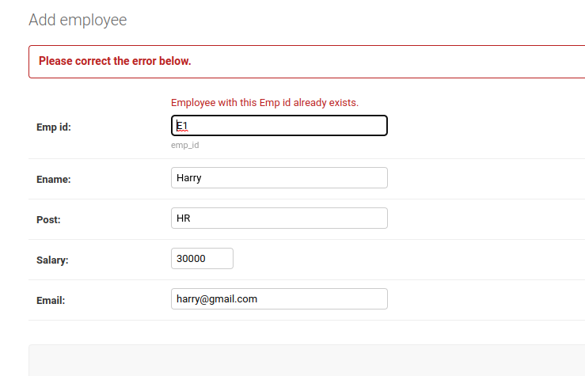

# Django ORM Web Application

## AIM
To develop a Django application to store and retrieve data from a database using Object Relational Mapping(ORM).

## Entity Relationship Diagram

Include your ER diagram here


## DESIGN STEPS

### STEP 1:
Start a project and create a superuser

### STEP 2:
Set a password and email

### STEP 3:
Make the necessary changes in the models and admin.Then make migrations and run the server

Write your own steps

## PROGRAM
```python
models.py program

from django.db import models
from django.contrib import admin


# Create your models here.
class Employee (models.Model):
    emp_id=models.CharField(primary_key=True,max_length=4,help_text="emp_id")
    ename=models.CharField(max_length=50)
    post=models.CharField(max_length=20)
    salary=models.IntegerField()
    email=models.EmailField()

class EmployeeAdmin(admin.ModelAdmin):
    list_display=('emp_id','ename','post','salary','email')
Include your code here

admin.py program

from django.contrib import admin
from .models import Employee,EmployeeAdmin


# Register your models here.
admin.site.register(Employee,EmployeeAdmin)
```
## OUTPUT


Include the screenshot of your admin page.



## RESULT
